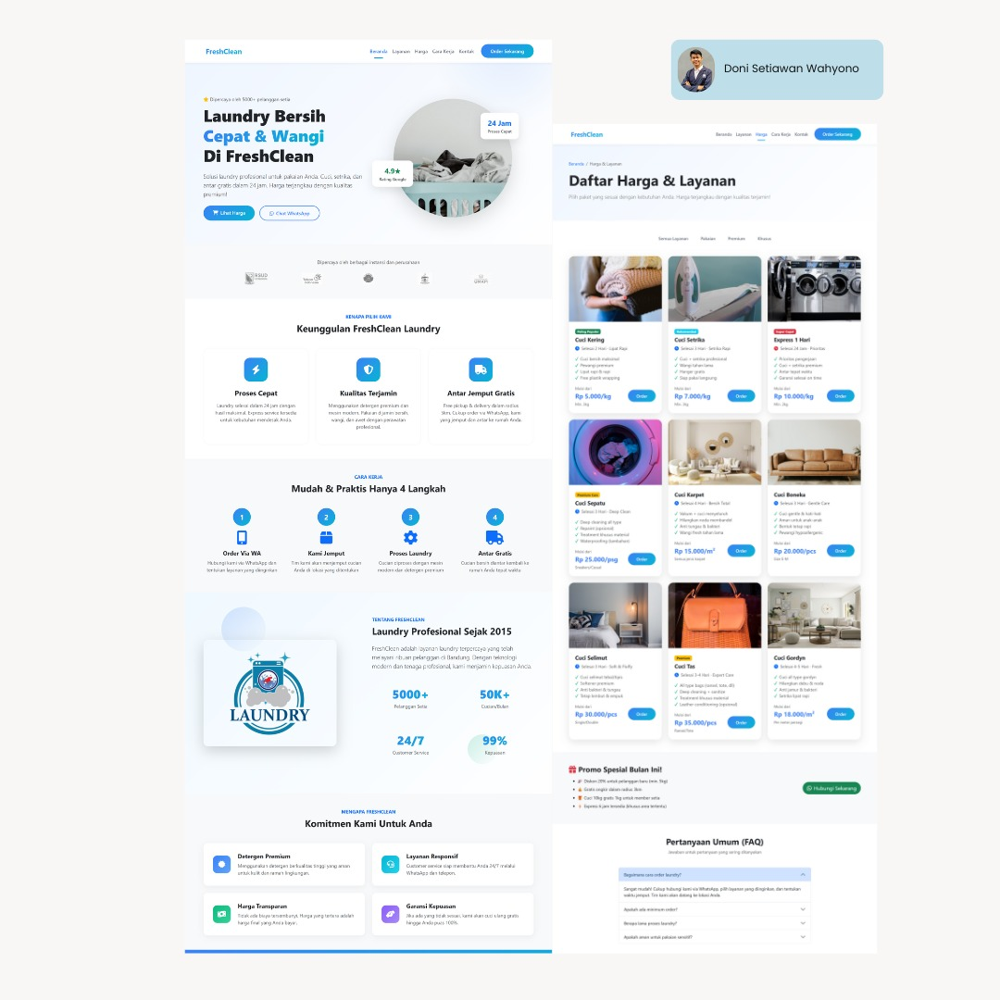
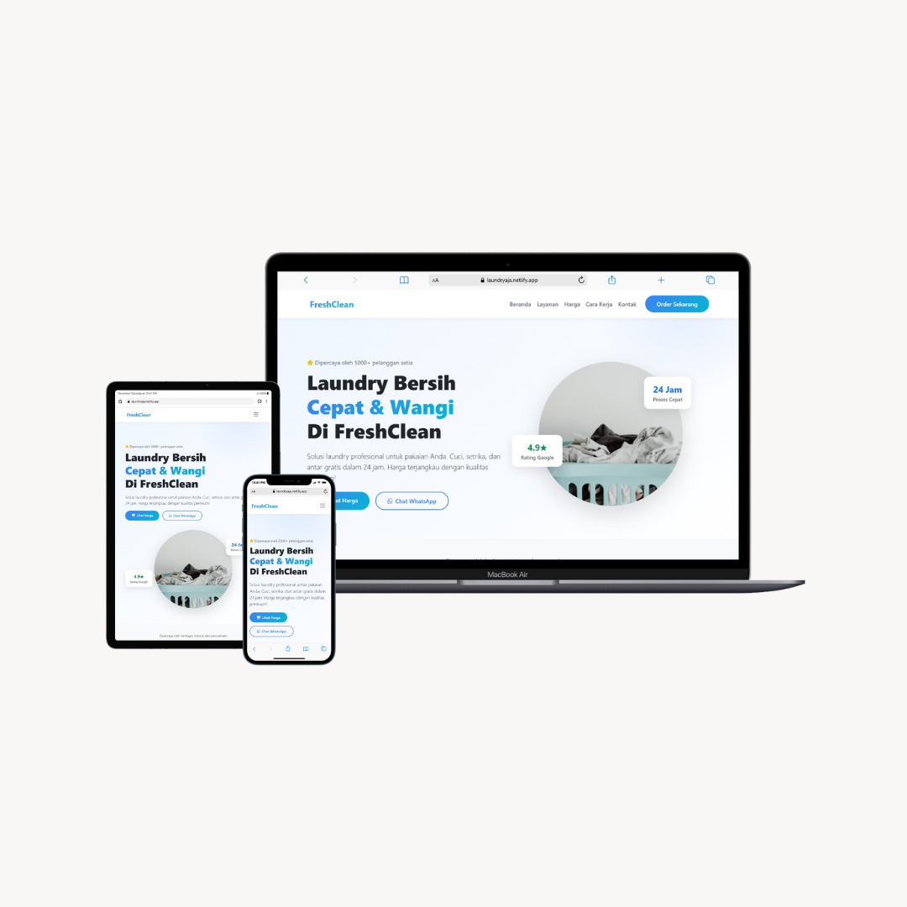

# 🧺 FreshClean - Modern Laundry Landing Page

[](https://github.com/donisettt/landing-page-laundry-responsive/stargazers)
[](https://github.com/donisettt/landing-page-laundry-responsive/network/members)
[](https://github.com/donisettt/landing-page-laundry-responsive/issues)
[](https://opensource.org/licenses/MIT)

> A beautiful, modern, and fully responsive landing page template for laundry services. Perfect for local businesses, startups, or as a portfolio project. Built with Bootstrap 5 and vanilla JavaScript.

[Live Demo](https://laundryaja.netlify.app/) | [Documentation](#features) | [Report Bug](https://github.com/donisettt/landing-page-laundry-responsive/issues) | [Request Feature](https://github.com/donisettt/landing-page-laundry-responsive/issues)

<div align="center">
  
  
</div>

---

## Features

### **Modern & Clean Design**

- Contemporary UI/UX design with smooth animations
- Eye-catching hero section with floating badges
- Professional color scheme and typography
- Glassmorphism effects and gradients

### **Fully Responsive**

- Mobile-first approach
- Perfect display on all devices (mobile, tablet, desktop)
- Optimized touch interactions
- Hamburger menu for mobile navigation

### **Performance Optimized**

- Lightweight and fast loading
- Optimized images and assets
- Minimal dependencies
- Clean and semantic HTML5

### **Key Sections**

- **Hero Section** - Compelling headline with CTA buttons
- **Partners/Clients** - Logo showcase section
- **Features** - Service highlights with icons
- **Process Steps** - 4-step workflow visualization
- **About/Stats** - Company information with statistics
- **Why Choose Us** - Competitive advantages
- **Newsletter** - Email subscription form
- **Footer** - Multi-column footer with links

### **Built With**

- **Bootstrap 5.3.2** - Responsive framework
- **Font Awesome 6.4.0** - Icon library
- **Vanilla JavaScript** - No jQuery needed
- **CSS3** - Custom animations and effects

### **Interactive Elements**

- Smooth scroll navigation
- Scroll-triggered animations
- Navbar shadow on scroll
- Intersection Observer API
- Hover effects on cards

---

## hat's Included

```
✅ Responsive navbar with mobile menu
✅ Hero section with CTAs
✅ Client/partner logos section
✅ Feature cards with icons
✅ Process/workflow steps
✅ Statistics counter section
✅ Benefits/advantages section
✅ Newsletter signup form
✅ Multi-column footer
✅ Smooth scroll navigation
✅ Scroll animations
✅ SEO-friendly structure
✅ Social media links
✅ Contact information
```

---

## Use Cases

This template is perfect for:

- 🧺 **Laundry Services** - The original purpose
- 🏠 **Home Services** - Cleaning, maintenance, repair
- 🍕 **Food Delivery** - Restaurants, catering
- 📦 **Logistics** - Delivery, courier services
- 💆 **Beauty & Spa** - Salons, wellness centers
- 🎓 **Education** - Courses, training centers
- 🏋️ **Fitness** - Gyms, personal training
- 🛠️ **Any Local Business** - Easy to customize

---

## Browser Support

| Browser | Support   |
| ------- | --------- |
| Chrome  | ✅ Latest |
| Firefox | ✅ Latest |
| Safari  | ✅ Latest |
| Edge    | ✅ Latest |
| Opera   | ✅ Latest |

---

## Responsive Breakpoints

```css
/* Mobile First Approach */
Mobile:  < 576px
Tablet:  576px - 768px
Desktop: 768px - 992px
Large:   992px - 1200px
XL:      > 1200px
```

---

## Learning Resources

Perfect for learning:

- HTML5 semantic structure
- Bootstrap 5 grid system
- CSS3 animations
- JavaScript DOM manipulation
- Responsive design principles
- Intersection Observer API

---

## 🤝 Contributing

Contributions are welcome! Please feel free to submit a Pull Request.

1. Fork the Project
2. Create your Feature Branch (`git checkout -b feature/AmazingFeature`)
3. Commit your Changes (`git commit -m 'Add some AmazingFeature'`)
4. Push to the Branch (`git push origin feature/AmazingFeature`)
5. Open a Pull Request

---

## License

This project is licensed under the MIT License - see the [LICENSE](LICENSE) file for details.

---

## Author

**Doni Sw**

- GitHub: [@donisettt](https://github.com/donisettt)
- Website: [https://doni.dev](https://doni.dev)
- Email: donisetiawanwahyono@gmail.com

---

## Acknowledgments

- [Bootstrap](https://getbootstrap.com/) - Frontend framework
- [Font Awesome](https://fontawesome.com/) - Icon library
- [Unsplash](https://unsplash.com/) - Free images
- [Google Fonts](https://fonts.google.com/) - Typography

---

## Show Your Support

Give a ⭐️ if this project helped you!

---

## SEO Optimized

This template includes:

- ✅ Semantic HTML5 structure
- ✅ Meta tags for social sharing
- ✅ Optimized headings hierarchy
- ✅ Alt text for images
- ✅ Fast loading speed
- ✅ Mobile-friendly design
- ✅ Structured data ready

---

## Keywords

`responsive landing page`, `bootstrap template`, `laundry website`, `business landing page`, `modern design`, `mobile responsive`, `html template`, `free template`, `portfolio project`, `frontend development`, `web design`, `bootstrap 5`, `landing page template`, `service website`, `small business website`

---

<div align="center">
  <p>Made with ❤️ by Doni Sw</p>
  <p>© 2025 FreshClean. All Rights Reserved.</p>
</div>
